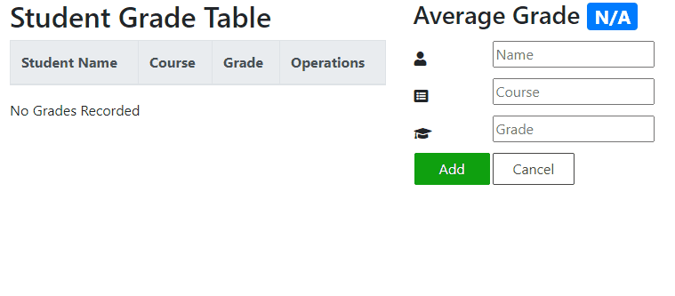

# student-grade-table
An interactive JavaScript application that communicates with a server to manage grade records.

## Technologies Used

- Bootstrap 4
- HTML5
- CSS3

## Features

- Teachers can view a list of recorded grades.
- Teachers can view the average grade.
- Teachers can add a grade to the table.
- Teachers can delete a grade from the table.

## Preview



### Getting Started

1. Clone the repository.

    ```shell
    git clone https://github.com/Jake-Mertz/student-grade-table.git
    cd sgt-react
    ```

1. Install all dependencies with NPM.

    ```shell
    npm install
    ```

1. Import the example database to MongoDB.

    ```shell
    mongoimport --db sgt-react database/dump.json
    ```

1. Start the project. Once started you can view the application by opening http://localhost:3000 in your browser.

    ```shell
    npm run dev
    ```
